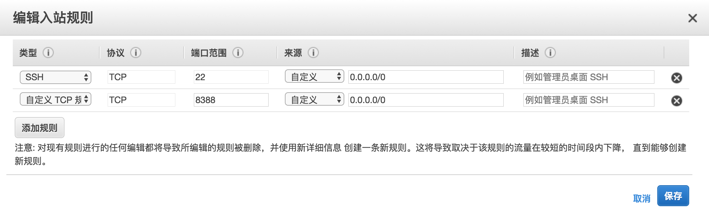
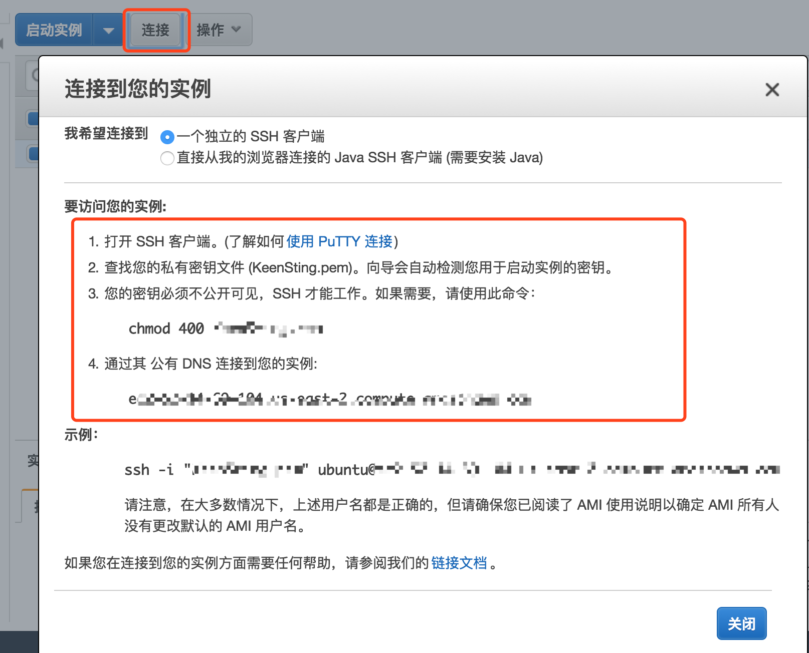
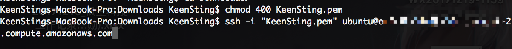

# select instance

1. Ubuntu Server 16.04 LTS (HVM), SSD Volume Type - ami-916f59f4
2. 选择“在没有密钥的时候继续”
3. 找到“安全组”
4. 配置以下信息：操作-编辑入站规则

```conf
SSH           TCP 22     0.0.0.0/0
自定义TCP规则   TCP 8388   0.0.0.0/0
```
5. 使用ssh远程访问AWS服务器之前的准备。AWS提供了两种方法一个是直接在浏览器登录（不支持chrome），另一个就是ssh，需要先下载秘钥，秘钥的权限需要修改为400，红框中的信息请仔细看

6. ssh链接服务器



## resouces:
+ https://blog.csdn.net/f59130/article/details/74014415
+ https://blog.csdn.net/liangxun0712/article/details/78840964